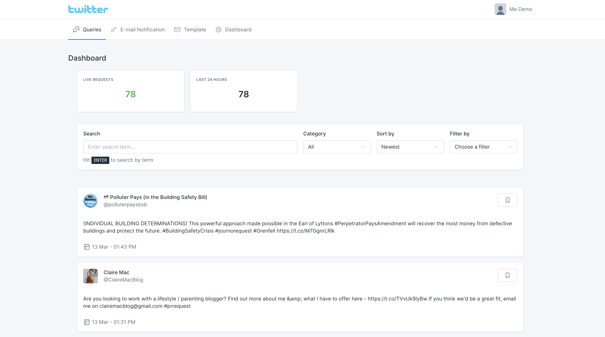

# Sourcee.app

<p align="center">
      
</p>


Get in the press 📰 Be the source a journalist is looking for.



## Requirements

- PHP >= 7.4

## Getting started

### Dependencies installation

*(Assuming you've [installed Composer](https://getcomposer.org/doc/00-intro.md))*

Fork this repository, then clone your fork, and run this in your newly created directory:

``` bash
composer install
```

### Project configuration

Next you need to make a copy of the `.env.example` file and rename it to `.env` inside your project root.

Run the following command to generate your app key:

``` bash
php artisan key:generate
```

Run the database migrations (**Set the [database connection](https://laravel.com/docs/8.x/database#configuration) in .env before migrating**)

``` bash
php artisan migrate && php artisan db:seed
```

Then start your server:

``` bash
php artisan serve
```
You can now access the server at http://127.0.0.1:8000

To see all defined routes and corresponding controllers methods use `php artisan route:list` console command

Queue listen

``` bash
php artisan queue:work --timeout=2000 --sleep=3 --tries=3 --daemon
```

Run scheduled commands

``` bash
php artisan schedule:run
```

## Mail configuration
`MAIL_MAILER`=smtp

`MAIL_HOST`=baddi.info

`MAIL_PORT`=465

`MAIL_USERNAME`=noreply@baddi.info

`MAIL_PASSWORD`=VR4sE0JIBOHP

`MAIL_ENCRYPTION`=SSL

`MAIL_FROM_ADDRESS=`noreply@baddi.info

---

## Twitter API Config variables

- TWITTER_BEARER_TOKEN

    `Set your Twitter App API bearer token you can get it from your Twitter developer account`
    
- TWITTER_MAIN_HASHTAGS

    `Set main hashtags for queries`
    
## Stripe API Config variables

- STRIPE_API_SECRET_KEY

    `Set your Stripe API secret key you can get it from your Stripe account`