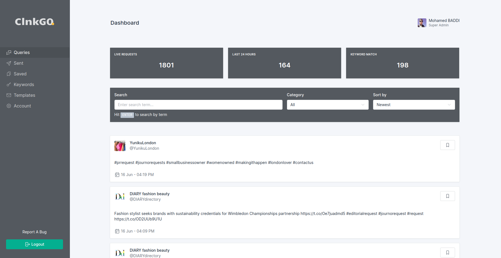

# ClnkGO

<p align="center">
      
</p>


Get in the press 📰 Be the source a journalist is looking for.



## Requirements

- PHP >= 7.4
- Docker

## Get started

### Setup

1. Clone the repository into `~/dev`

```bash
git clone git@github.com:baddiservices/clnkgo.io.git
```

2. To avoid user/group permissions issues, let's export your user ID & group ID

```bash
export WWWUSER=$(id -u ${USER}) WWWGROUP=$(id -g ${USER})
```

3. Copy `.env.example` to `.env`

```bash
cp .env.example .env
```

4. Build docker containers

```bash
docker-compose up -d
```

5. Check all containers are running

```bash
docker-compose ps
```

| NAME          |        COMMAND         |       SERVICE |            STATUS |                                          PORTS |
|---------------|:----------------------:|--------------:|------------------:|-----------------------------------------------:|
| mysql | "tini -- /docker-ent…" | mysql-server | running (healthy) |                         0.0.0.0:3306->3306/tcp |
| clnkgo   |   "start-container"    |         php71 |           running |                             0.0.0.0:80->80/tcp |

6. Connect to app container via SSH

```bash
docker-compose exec clnkgo /bin/bash
```

7. Install project dependencies

```bash
> composer install && php artisan key:generate && php artisan storage:link
```

8. Run migration and seed default data

```bash
> php artisan migrate && php artisan db:seed && php artisan passport:install
```

9. Build front end

```bash
> npm install && npm run dev
```

### Dependencies installation

*(Assuming you've [installed Composer](https://getcomposer.org/doc/00-intro.md))*

Fork this repository, then clone your fork, and run this in your newly created directory:

``` bash
composer install
```

### Project configuration

Next you need to make a copy of the `.env.example` file and rename it to `.env` inside your project root.

Run the following command to generate your app key:

``` bash
php artisan key:generate
```

Run the database migrations (**Set the [database connection](https://laravel.com/docs/8.x/database#configuration) in .env before migrating**)

``` bash
php artisan migrate && php artisan db:seed
```

Then start your server:

``` bash
php artisan serve
```
You can now access the server at http://127.0.0.1:8000

To see all defined routes and corresponding controllers methods use `php artisan route:list` console command

Queue listen

``` bash
php artisan queue:work --timeout=2000 --sleep=3 --tries=3 --daemon
```

Run scheduled commands

``` bash
php artisan schedule:run
```

## Mail configuration
`MAIL_MAILER`=smtp

`MAIL_HOST`=baddi.info

`MAIL_PORT`=465

`MAIL_USERNAME`=noreply@baddi.info

`MAIL_PASSWORD`=VR4sE0JIBOHP

`MAIL_ENCRYPTION`=SSL

`MAIL_FROM_ADDRESS=`noreply@baddi.info

---

## Twitter API Config variables

- TWITTER_BEARER_TOKEN

    `Set your Twitter App API bearer token you can get it from your Twitter developer account`
    
- TWITTER_MAIN_HASHTAGS

    `Set main hashtags for queries`
    
## Stripe API Config variables

- STRIPE_API_SECRET_KEY

    `Set your Stripe API secret key you can get it from your Stripe account`